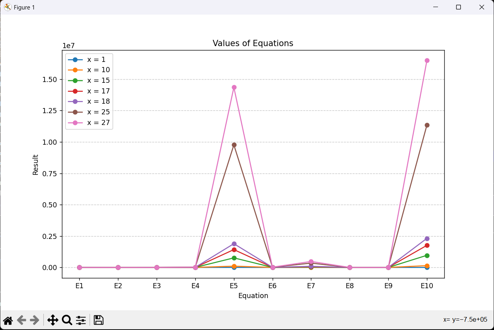

# Evaluating Equations

This Python script contains read, write, and append filehandling and graphing using Matplotlib.
It evaluates a set of equations for specified values of x and plots the results. 

**Input Equations**: Write your equations in a file named `equations.txt`, with each equation written on a separate line in the format `E1 = expression`,
                      where `E1` is the equation label and `expression` is the mathematical expression involving `x`

**Input Values of x**: When prompted, enter the values of x (1 to 50) separated by commas. 

**View Results**: The script will evaluate the equations for each value of x, plot the results using Matplotlib, and save the results to a file named `results.txt`.

**Remove Numbers**: Optionally, you can choose to remove specific numbers from the plotted results, and save the new results to a file named `results.txt`.

**Continue or Exit**: After viewing the results, you can choose to continue with different numbers or exit the script.

## Package Installed
- Matplotlib
- math 
- numpy

## Screenshots

